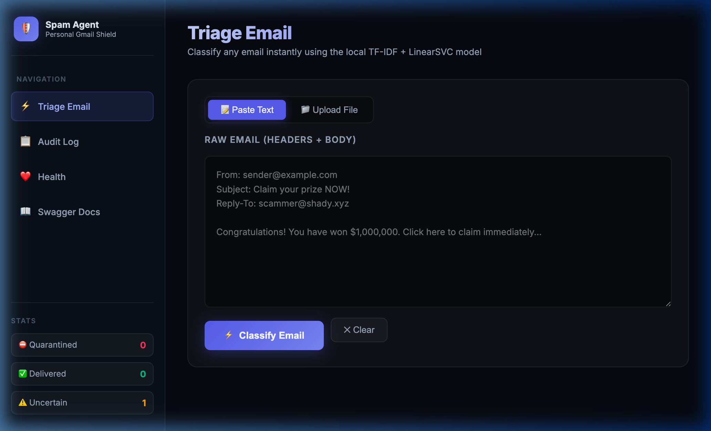
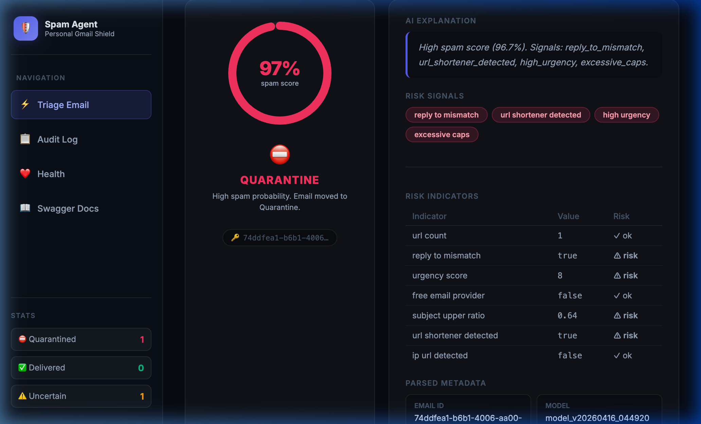
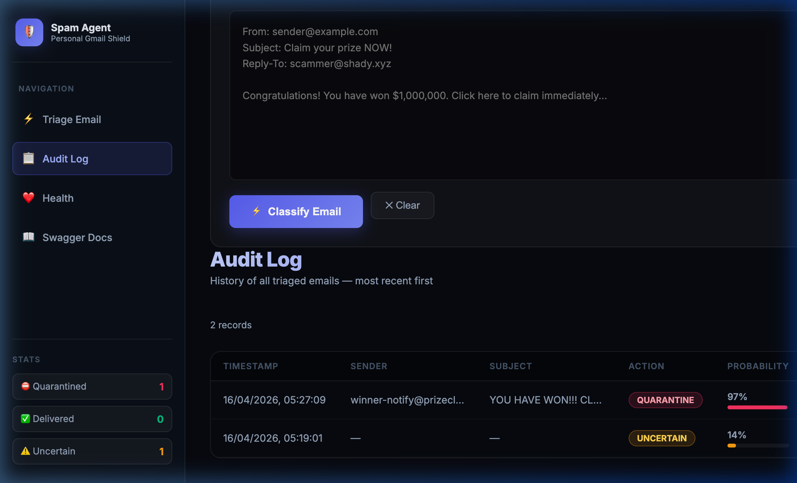
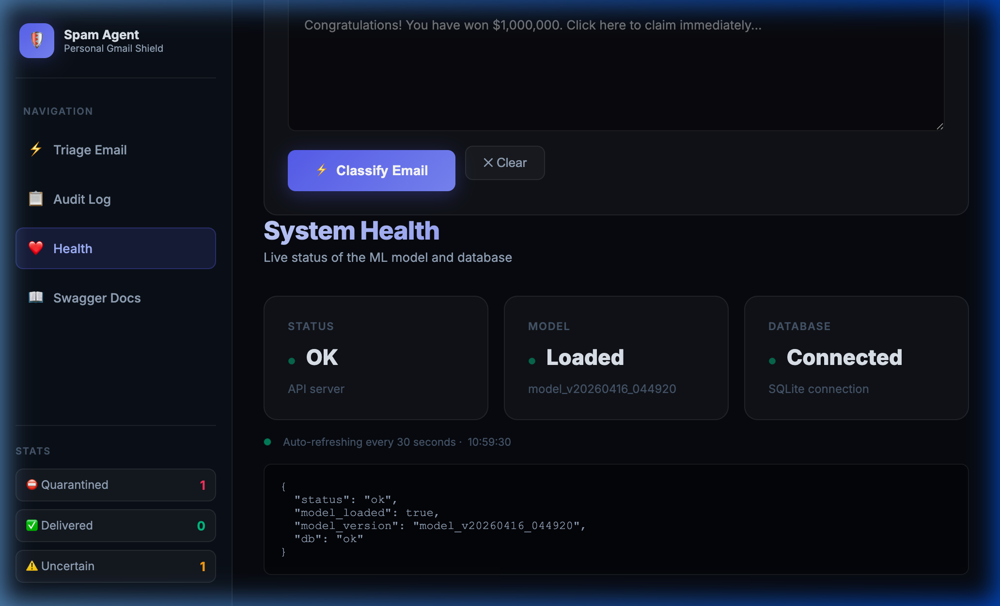

<h1 align="center">
  🛡️ Spam Agent — Personal Gmail Shield
</h1>

<p align="center">
  <b>A production-grade, ML-powered email spam classifier with a premium dark-mode SPA dashboard.</b><br/>
  Paste or upload any raw email and get an instant QUARANTINE / DELIVER / UNCERTAIN verdict.
</p>

<p align="center">
  <a href="https://spam-agentspam-agent-personal-produ.vercel.app/" target="_blank">
    
  </a>
  &nbsp;
  
  &nbsp;
  
  &nbsp;
  
  &nbsp;
  
</p>

---

## 🌐 Live Demo

**[→ spam-agentspam-agent-personal-produ.vercel.app](https://spam-agentspam-agent-personal-produ.vercel.app/)**

Paste any raw email (including headers) and get a live classification in under 500ms.

---

## ✨ Screenshots

### Dashboard — Triage Email View


### Live Classification — ⛔ QUARANTINE at 97% Spam Score


### Audit Log — Timestamped history with probability bars


### System Health — Live model & database status


---

## 🚀 Features

| Feature | Details |
|---|---|
| **Email Triage** | Paste raw email (with headers) or drag-and-drop `.eml` / `.txt` files |
| **3-Class Verdict** | `QUARANTINE` (p > 0.75), `UNCERTAIN` (0.35–0.75), `DELIVER` (p < 0.35) |
| **Risk Indicators** | URL shorteners, Reply-To mismatch, urgency score, excessive caps, IP URLs |
| **AI Explanation** | Plain-English explanation included with every verdict |
| **Audit Log** | Searchable, paginated history of all triaged emails with probability bars |
| **Feedback Loop** | Mark any verdict correct/incorrect → queued for next model retrain |
| **System Health** | Live polling of model status, DB connectivity, model version |
| **IMAP Watcher** | Optional background watcher for live Gmail polling |
| **Swagger UI** | Full `/docs` for direct API access |

---

## 🧠 ML Pipeline

```
Raw Email → Parse (email stdlib) → Feature Extraction → TF-IDF Vectoriser → LinearSVC
                                                                          ↓
                                                              CalibratedClassifierCV
                                                              (calibrated probabilities)
                                                                          ↓
                                                         QUARANTINE / UNCERTAIN / DELIVER
```

### Model Performance (SpamAssassin Corpus)
| Metric | Value |
|---|---|
| Training Samples | 3,002 (501 spam + 2,501 ham) |
| Algorithm | LinearSVC + CalibratedClassifierCV |
| Features | TF-IDF (max 30,000 features) + 10 hand-crafted risk signals |
| Cross-Validation F1 | **0.9900 ± 0.0084** |
| Model Registry | Versioned `.pkl` files with UTC timestamps |

### Risk Signals Extracted Per Email
- `url_count` — total URLs in body
- `url_shortener_detected` — bit.ly, tinyurl, etc.
- `ip_url_detected` — raw IP address in links
- `reply_to_mismatch` — From ≠ Reply-To domain
- `urgency_score` — count of urgency phrases ("act now", "claim immediately")
- `excessive_caps` — ratio of uppercase characters
- `subject_upper_ratio` — uppercase in subject line
- `free_email_provider` — gmail/yahoo/hotmail senders

---

## 🗂️ Project Structure

```
email-spam-agent/
├── api/
│   └── index.py              # Vercel ASGI entrypoint
├── app/
│   ├── main.py               # FastAPI app, all endpoints
│   ├── db/
│   │   ├── models.py         # SQLAlchemy ORM models
│   │   ├── crud.py           # DB read/write helpers
│   │   └── session.py        # Engine + session factory
│   ├── features/
│   │   └── extractors.py     # Risk signal extractors
│   ├── ml/
│   │   ├── model.py          # Model loader (SpamClassifier)
│   │   └── train.py          # Training pipeline (SpamAssassin corpus)
│   └── templates/
│       └── index.html        # Premium SPA dashboard
├── data/
│   ├── spam/                 # SpamAssassin spam corpus (gitignored)
│   └── ham/                  # SpamAssassin ham corpus (gitignored)
├── model_registry/
│   └── model_v*.pkl          # Versioned trained models
├── docs/
│   └── screenshots/          # README screenshots
├── vercel.json               # Vercel deployment config
├── runtime.txt               # python-3.12
└── requirements.txt
```

---

## 🛠️ Local Setup

```bash
# 1. Clone the repo
git clone https://github.com/keshav2101/spam-agent-personal-production.git
cd spam-agent-personal-production

# 2. Create a virtual environment
python3 -m venv .venv
source .venv/bin/activate

# 3. Install dependencies
pip install -r requirements.txt

# 4. Create your .env file
cp .env.example .env
# (Optional) Add your IMAP credentials for live Gmail polling

# 5. Download training data and train the model
# Download SpamAssassin corpus into data/spam/ and data/ham/
# then:
python -m app.ml.train

# 6. Start the API server
uvicorn app.main:app --host 0.0.0.0 --port 8000 --reload
# → Open http://localhost:8000
```

---

## ☁️ Vercel Deployment

This repo is pre-configured for one-click Vercel deployment.

```bash
npm install -g vercel
vercel --prod
```

Or **import directly** from the Vercel dashboard → Import Git Repository → `keshav2101/spam-agent-personal-production`.

> **Note:** Vercel uses ephemeral `/tmp` SQLite (audit records reset on cold starts). For persistent logs, set `DATABASE_URL` to a Postgres connection string (e.g., [Neon](https://neon.tech)).

---

## 📡 API Endpoints

| Method | Endpoint | Description |
|---|---|---|
| `GET` | `/` | Premium SPA dashboard |
| `POST` | `/triage` | Classify raw email text |
| `POST` | `/ui/triage_file` | Classify uploaded `.eml`/`.txt` file |
| `POST` | `/feedback` | Submit label correction |
| `GET` | `/audit` | List recent audit records |
| `GET` | `/audit/stats` | Aggregate counts (quarantine/deliver/uncertain) |
| `GET` | `/audit/{email_id}` | Full record for a single email |
| `GET` | `/health` | Model + DB status |
| `GET` | `/docs` | Swagger UI |

**Triage request example:**
```bash
curl -X POST https://spam-agentspam-agent-personal-produ.vercel.app/triage \
  -H "Content-Type: application/json" \
  -d '{"raw_email": "From: spammer@evil.com\nSubject: WIN NOW!\n\nClick here immediately!"}'
```

**Response:**
```json
{
  "email_id": "uuid-here",
  "action": "QUARANTINE",
  "spam_probability": 0.967,
  "indicators": { "urgency_score": 5, "excessive_caps": true },
  "explanation": "High spam score (96.7%). Signals: high_urgency, excessive_caps."
}
```

---

## 🔄 Retraining the Model

After collecting enough feedback submissions:

```bash
python -m app.ml.train
# → New model saved to model_registry/model_vYYYYMMDD_HHMMSS.pkl
# Reload the server to pick it up (uvicorn --reload does this automatically)
```

---

## 🧰 Tech Stack

| Layer | Tech |
|---|---|
| **API Framework** | FastAPI + Uvicorn |
| **ML** | scikit-learn (LinearSVC + CalibratedClassifierCV), TF-IDF |
| **Database** | SQLite (local) / Postgres (production via env var) |
| **Frontend** | Vanilla HTML/CSS/JS SPA · Dark glassmorphism design |
| **Deployment** | Vercel (Python serverless) |
| **Training Data** | SpamAssassin Public Corpus |

---

## 📄 License

MIT © [keshav2101](https://github.com/keshav2101)
