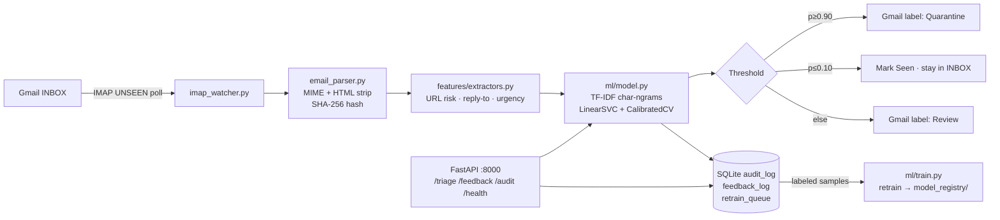

# Personal Gmail Spam Detection Agent

**Stack:** Python 3.11 · FastAPI · scikit-learn · SQLite · Gmail IMAP (App Password)  
**No paid services. No cloud APIs. Runs on your laptop.**

---

## Architecture


---

## Thresholds
| Probability | Action | Gmail Label |
|---|---|---|
| `p ≥ 0.90` | QUARANTINE | → `Quarantine` folder |
| `0.10 < p < 0.90` | UNCERTAIN | → `Review` folder |
| `p ≤ 0.10` | DELIVER | Stay in INBOX (marked Seen) |

---

## Quick Start (No Docker)

```bash
cd spam_agent_personal

# 1. Install dependencies
python -m pip install -r requirements.txt

# 2. Copy and fill in .env
copy .env.example .env
# Edit .env: set IMAP_USER, IMAP_PASSWORD (App Password)

# 3. Train the initial model (requires data/ folder — see Seed Dataset below)
python -m app.ml.train

# 4. Start the API
python -m uvicorn app.main:app --host 0.0.0.0 --port 8000 --reload

# 5. Start the IMAP watcher (separate terminal)
python -m app.imap_watcher

# 6. Open dashboard
start http://localhost:8000
```

---

## Gmail Setup

### a) Enable Gmail IMAP
1. Open Gmail → **Settings** → **See all settings**
2. Go to **Forwarding and POP/IMAP** tab
3. Set **IMAP Access: Enable IMAP** → Save

### b) Create an App Password
> Required if you have 2-Step Verification (recommended).

1. Go to [myaccount.google.com/apppasswords](https://myaccount.google.com/apppasswords)
2. Select app: **Mail** · device: **Other (Custom)** → name it "SpamAgent"
3. Copy the 16-character password into `.env` as `IMAP_PASSWORD`

### c) Create Gmail Labels
In Gmail web: **Create new label** → `Quarantine`  
Create another → `Review`

These will appear as IMAP folders that the watcher copies emails into.

---

## Docker (optional)

```bash
# Copy and fill in .env first
docker compose up --build -d
docker compose logs -f
```

---

## Seed Dataset (for initial training)

```bash
# 1. Download SpamAssassin corpus
#    https://spamassassin.apache.org/old/publiccorpus/
#    Download: 20030228_spam.tar.bz2 and 20030228_easy_ham.tar.bz2

# 2. Extract into data/
mkdir -p data/spam data/ham
tar -xjf 20030228_spam.tar.bz2     -C data/spam --strip-components=1
tar -xjf 20030228_easy_ham.tar.bz2 -C data/ham  --strip-components=1

# 3. Train (from spam_agent_personal/ root)
python -m app.ml.train
# → Outputs: model_registry/model_vYYYYMMDD_HHMMSS.pkl
```

---

## Endpoints

| Method | URL | Description |
|---|---|---|
| `GET` | `/` | Dashboard UI |
| `GET` | `/health` | Model + DB status |
| `POST` | `/triage` | Classify raw email text |
| `POST` | `/ui/triage_file` | Upload .eml/.pdf/.txt/.json |
| `POST` | `/feedback` | Submit label correction |
| `GET` | `/audit/{email_id}` | Get single audit record |
| `GET` | `/audit?limit=50` | List recent audit records |
| `GET` | `/docs` | Swagger UI |

---

## Retraining

```bash
# After submitting feedback via /feedback endpoint:
python -m app.ml.train
# → Reads new feedback from DB + seed corpus
# → Saves new versioned model to model_registry/
# → Restart API to load new model (or call classifier.load_latest())
```

---

## File Structure

```
spam_agent_personal/
├── app/
│   ├── main.py                 # FastAPI endpoints
│   ├── imap_watcher.py         # Gmail IMAP polling loop
│   ├── features/extractors.py  # URL/domain/urgency risk signals
│   ├── parsing/email_parser.py # MIME + HTML → text + SHA-256 hashes
│   ├── ml/
│   │   ├── model.py            # Calibrated classifier loader
│   │   └── train.py            # Retrain script
│   ├── db/
│   │   ├── models.py           # SQLAlchemy ORM
│   │   ├── session.py          # Engine + get_db()
│   │   └── crud.py             # All DB operations
│   ├── models/schemas.py       # Pydantic schemas
│   └── templates/index.html    # Dashboard UI
├── model_registry/             # Versioned .pkl model files
├── data/spam/ data/ham/        # Training corpus
├── requirements.txt
├── .env.example
├── Dockerfile
├── docker-compose.yml
└── README.md
```
